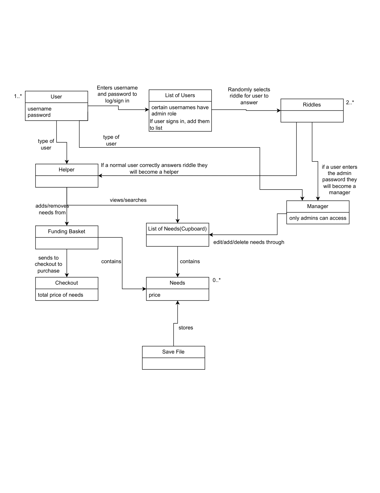
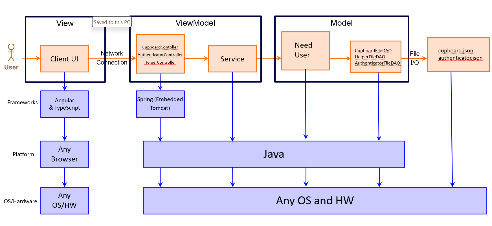
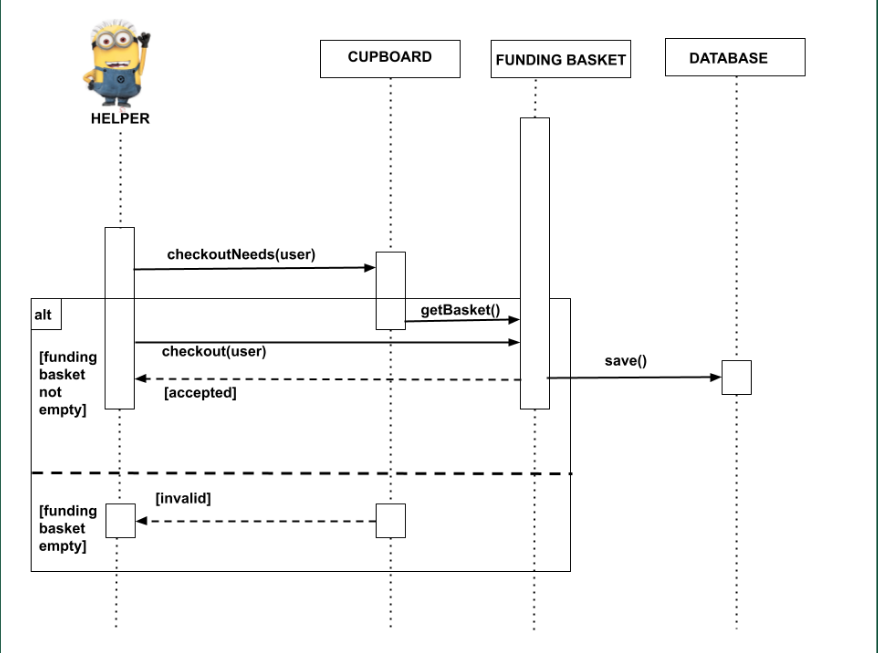
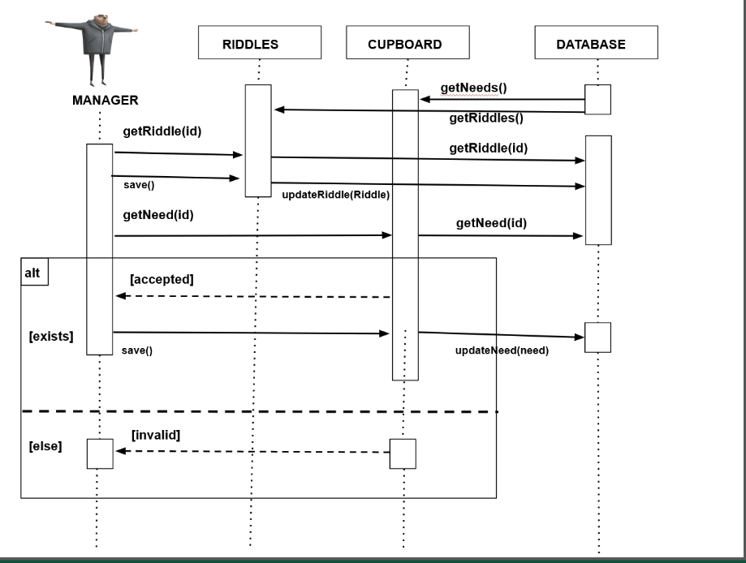
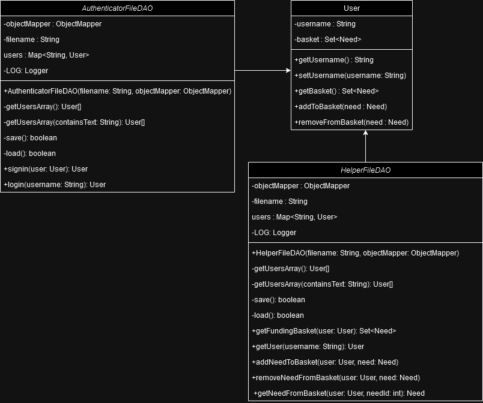
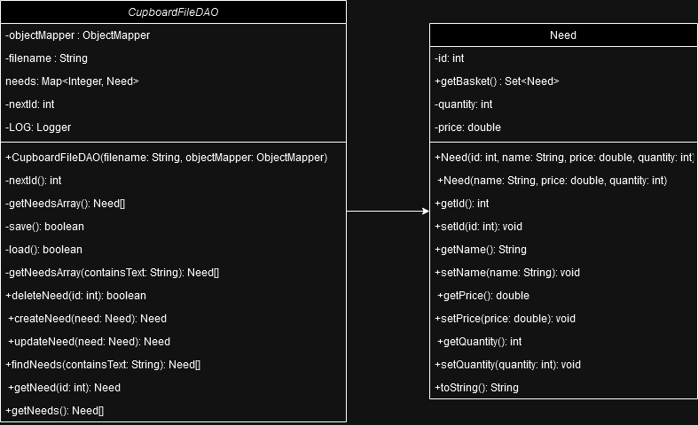
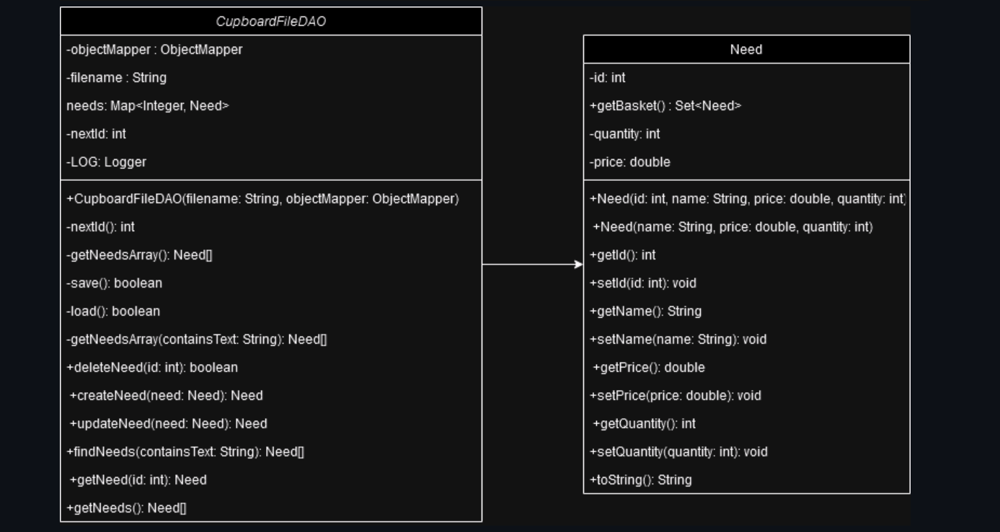
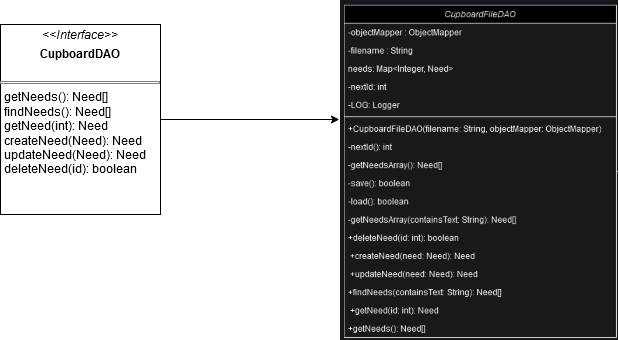
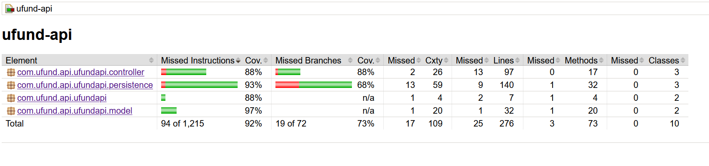

# PROJECT Design Documentation

## Team Information
* Team name: lowercase_h
* Team members
  * Yat Long Chan
  * Graden Olson
  * Ben Hemmers
  * Vincent Son
  * Guangcheng Liu

## Executive Summary

Currently, villains have been severely underfunded compared to heroes. At Money For Masterminds, we hope to lessen the financial disparities between through groups through a crowdfunding application. With our application, super villains will be able fund their evil schemes through the help of generous donors. 

### Purpose

Money For Masterminds is a management system that allows super villains to put out a list of needs and have other people donate to those needs.

### Glossary and Acronyms

| Term | Definition |
|------|------------|
| SPA | Single Page |
| Need | Something that the villain needs funding for; an object, tool, scheme, etc. |
| Cupboard | A list of Needs posted by a villain |
| Funding Basket | A "shopping cart" full of Needs that a user intends on funding |
| Manager | A super villain/admin who has Needs and wants funding for their plans |
| Helper | A user who can fund a Manager's Needs |
| Checkout | The process by which a Helper funds all the Needs in their Funding Basket |
| DAO | Data Access Object. A class that interacts with a file to retrieve information. |

## Requirements

In Money for Masterminds, users are divided between Helpers and Managers.

Managers are super villains who can create a Cupboard and fill it with a list of Needs that they want to get funded by Helpers. Managers can edit the contents of their Cupboard as much as they want: they can add new Needs, delete old Needs, edit Needs, or update Needs. Managers can also create and edit riddles to secure the page on the log-in process.

Helpers are users that want to fund Managers/super villains, which they can do by exploring a Cupboard and purchasing any Needs that they want. Helpers have access to their own Funding Basket, which they can use to checkout any Needs they've added from a Cupboard and officially fund those Needs. Helpers have the ability to add Needs to their Funding Basket, remove Needs from their basket, edit the quantity of a Need in their basket, and checkout those Needs once they're done shopping for Needs. Helpers can also search for specific Needs in the villain's Cupboard, as well as choose from a list of popular or highly requested Needs.

Money for Masterminds also has a thorough authentication procedure so that all users can log into their accounts with a username, password, and a successfully solved riddle prompted to the user on the log-in page. There is also a log-out functionality so that users can exit their account after signing in.

### Definition of MVP

A manager user is able to log in to the web app through the `admin` username. They are then able to add, remove, and edit needs in their cupboard as well as search for individual needs.
A helper user is able to sign up with and login to a unique username. They are able to search for needs and add and remove them from their funding basket.

### MVP Features

EPICS
 - Authenticator: As a user I want to sign/log in so that I can access the site.
 - Manager: As a manager I want to manage my needs so that helpers will fund them.
 - Helper: As a helper I want to manage my funding basket so that I can contribute to needs in an organized manner.

STORIES
 - Get Entire Cupboard: As a developer I want to submit a request to get the cupboard so that I can update needs in the cupboard.
 - Create New Need: As a developer I want to submit a request to create a new need (name [unique], cost, quantity, type) so that it is added to the cupboard.
 - Delete Single Need: As a developer I want to submit a request to delete a single need so that it is no longer in the cupboard.
 - Get Single Need: As a developer I want to submit a request to get a single need so that I can access the cost, quantity, and type.
 - Search for Needs: As a developer I want to submit a request to get the needs in the cupboard whose name contains the giveen text, so that I have access to only that subset of needs.
 - Update a Need: As a developer I want to submit a request to get the entire cupboard so that I have acceses to all of the needs for the organization.
 - Add Need: As a manager I want to add needs to my plan so that helpers can fund them.
 - Add Single Need: As a helper I want to add a need to my funding basket sos that I can keep track of the needs I want to contribute to.
 - View Funding Basket: As a helper I want to view my funding basket so that I can make changes to it.
 - Edit Need: As a helper I want to edit specific needs so that I can quickly change and make the need fit into its category.
 - Delete Need: As a manager I want to be able to delete needs sos that I can keep my need list up to date when needs are fulfilled.
 - Search for Needs: As a user I want to search for needs so that I can access a specific need.
 - Sign-in: As a user I want to sign up so that I can have an account.
 - Admin Access: As an admin I want to enter the admin password so that I can access the manager.
 - Log In: As a user I want to log in with my account so that I can access the site.
 - Password: As a developer I want to create a password so I can access the helper page more securely.
 - Checkout Funding Baskete: As a helper I want to checkout my funding basket so that I can contribute to my selected needs.
 - Riddles Login: As a user I want to solve riddles so that I can access my page more securely.
 - Riddles Management: As a manager I want to manage riddles so that I can better secure my page.
 - UI: As a user I want a better UI so that I can access the site with more ease.

### Enhancements

Money for Masterminds implements the addition of a password to the log-in. This increases the security of our application and ensures users only have access to their own accounts. 

Money for Masterminds implements a 'riddles' enhancement. This creates an extra step in the log-in phase for users that prompts them with a difficult riddle, increasing security for the website. If the user correctly answers the riddle (in addition to their username and password), only then can they access the website. Managers are also able to create and edit riddles to their liking sos they can better secure their page.

## Application Domain

This section describes the application domain.

The foundation of the Money For Masterminds application is the `Need`. A `Need` is a representation of a single component that a villain requires to complete their schemes.  
A villain or the `Manager` is able to manage their specific list of `Needs` through the `Cupboard`.  
A `Helper` is someone who is trying to fund a villain. They are able to search through the `Cupboard` for `Needs` they are looking to sponsor, and add them to a `Funding Basket`, which acts as a shopping cart. Through the `Funding Basket`, `Helpers` are able to remove `Needs` or `Checkout`, which represents the donations being made towards the specific `Needs` found in the `Funding Basket`. 
A `Riddle` is a representation of a question that a `User` will need to answer in order to gain access to all other functionality. 

## Architecture and Design

This section describes the application architecture.

### Summary

The following Tiers/Layers model shows a high-level view of the webapp's architecture. 

The web application, is built using the Model–View–ViewModel (MVVM) architecture pattern. 

The Model stores the application data objects including any functionality to provide persistance. 

The View is the client-side SPA built with Angular utilizing HTML, CSS and TypeScript. The ViewModel provides RESTful APIs to the client (View) as well as any logic required to manipulate the data objects from the Model.

Both the ViewModel and Model are built using Java and Spring Framework. Details of the components within these tiers are supplied below.

### Overview of User Interface

This section describes the web interface flow; this is how the user views and interacts with the web application.

The application's user interface effectively boils down into 2 sections: the helper's UI, and the manager's UI.

The helper UI includes 4 tabs/buttons that they can click between at the top of the page to navigate between the basic directories of the page. The user can traverse to the manager's cupboard, where they can click on a need to see more information about that need, and they can add a need to their funding basket. The helper can view their funding basket and click on needs in their funding basket to view them and any information about that need. The helper can checkout their funding basket with the checkout button at the button of the funding basket page. On the home page, the helper can search for needs and click on any found needs from the search bar, or navigate to popular needs.

The manager UI includes similar tabs to the helper, but the main difference is that the manager does not have a funding basket, and instead has their cupboard tab. On the cupboard page, the manager can view their needs. They can also view their riddles. On the cupboard page, they can edit needs, add needs, or delete needs directly on the page by clicking on an 'x' button hovering over existing needs, click on the need directly to edit it, or fill out a form in the center of the page to fill in information about a new need they would like to publish on their cupboard page.

### View Tier

In the view tier's checkout process, users review their selected items, enter shipping and payment details, and confirm their purchase. This phase ensures a seamless and efficient transaction, guiding users through the final steps of their shopping journey.

CheckoutNeeds(user) prompted to Cupboard first, then Funding Basket.
If the funding basket is already empty, then it will fail and won't execute checkout. Otherwise, it will update the database, as well as check out the remaining items in the funding basket.

> _**[Sprint 4]** You must  provide at least **2 sequence diagrams** as is relevant to a particular aspects 
> of the design that you are describing.  (**For example**, in a shopping experience application you might create a 
> sequence diagram of a customer searching for an item and adding to their cart.)
> As these can span multiple tiers, be sure to include an relevant HTTP requests from the client-side to the server-side 
> to help illustrate the end-to-end flow._

> _**[Sprint 4]** To adequately show your system, you will need to present the **class diagrams** where relevant in your design. Some additional tips:_
 >* _Class diagrams only apply to the **ViewModel** and **Model** Tier_
>* _A single class diagram of the entire system will not be effective. You may start with one, but will be need to break it down into smaller sections to account for requirements of each of the Tier static models below._
 >* _Correct labeling of relationships with proper notation for the relationship type, multiplicities, and navigation information will be important._
 >* _Include other details such as attributes and method signatures that you think are needed to support the level of detail in your discussion._

### ViewModel Tier
CupboardController: Used to handle HTTP requests to the API for manager and helper interactions with the cupboard.  
HelperController: Used to handle HTTP requests to the API for managing the funding basket.
RiddlesDAO: Used to handle HTTP requests to the API for managing riddles
AuthenticatorDAO: Used to handle HTTP requests to the API for managing user creation and authentication. 

> _**[Sprint 4]** Provide a summary of this tier of your architecture. This
> section will follow the same instructions that are given for the View
> Tier above._

> _At appropriate places as part of this narrative provide **one** or more updated and **properly labeled**
> static models (UML class diagrams) with some details such as critical attributes and methods._
> 

### Model Tier
Need: Object representation of a need.  
CupboardFileDAO: Used to interact with the file storage system and perform CRUD operations on Need objects.
User: Object representation of a user.
HelperFileDao: Used to interact with the file storage system and perform CRUD operations on User object funding baskets
Riddle: Object representation of a user
RiddleFileDAO: Used to interact with the file storage system and perform CRUD operations on riddles. 

## OO Design Principles

**Single Responsibility:** In sprint 1, the single responsibility principle is used to ensure that each class we create for our API  is only responsible for one aspect of the functionality. We separate our classes into the Model, Persistence, and Controller tiers. In the Model tier, we have the Need class, which acts as a reperesentation of a need but is not responsible for managing CRUD operations. In the Persistence tier, we have a CupboardFileDAO class which is responsible for managing only interacting with the file system and performing CRUD operations on Need objects. Finally, in the Controller tier, we have the Cupboard, Authenticator, and Helper Controllers, which are only responsible for responding to client HTTP requests.  

**Open/Closed:** We use the open/closed principle in sprint 1 mainly in the persistence tier. By creating a CupboardDAO interface, we can easily add additional operations to the API without removing any existing code, and we can work with alternative storage systems simply by creating another implementation of the Cupboard, Helper, Riddle, or AuthenticatorDAO interfaces. This also means that no code needs to be changed in the Controller tier if we were to switch to another storage system.

**Low Coupling:** We use low coupling to limit the number of unnecessary
relationships between classes. Working together with single responsibility, low coupling can be
used to make sure the relationship between classes fits into that classes’ single responsibility.
Low coupling should not be our biggest priority as long as we don’t overdo the amount of
relationships between classes. For example, we use
low coupling by having the manager access needs not through the Need class but through the
Cupboard class.

**Information Expert:** We use information experts to process data efficiently by
putting those operations in the class with the attribute data. This will make operations easier to understand when working in certain classes. Information experts
basically hide the more complicated looking operations in methods so that they can easily be
repeated and easier to understand when looking over the code. We have a User class so that operations in the Authenticator to check the user has correctly logged in can be easily
accessed. Need and Riddle are also examples of Information Expert.

**Dependency Inversion/Injection:** We focus on creating a layer of abstraction between high and low level modules. With these implementation, we do not need to directly couple between the modules. Instead, we will inject low level modules into high level modules to form loose coupling. We can implement this approach on a Cupboard controller that will interact with the interface CupBoardDAO instead of CupboardFileDAO to minimize tight coupling. We also use this approach in all our other Controllers and their respective persistence classes.

**Law of Demeter:** We aim to minimize the direct coupling between objects or classes where it is deemed unnecessary. Instead, we opt for the use of intermediaries that already possess established couplings to exchange data. This approach serves to restrict the influence one class has on another, such as when a class may need to change. By doing so, the impact of modifications becomes localized 
to the immediate coupling, enhancing the maintainability and flexibility of the system. For example, the CupboardDAO exhibits a direct coupling with the Need class. To access the Need class, we follow the route through CupboardDAO, ensuring a more controlled and encapsulated interaction between these components. In our Hepler and Authenticator DAOs, we use this principle with the User class, and Riddle with RiddleDAO.

**The Controller:** The controller principle is saying that the thing responsible for handling system operations should be a separate class. They are like a mediator between the user interface and logic which increase the flow of information. It is a non-user interface responsible to receive or handle an event. An example of this in our code is the CupboardController class. This is also applied to all other classes in the Controller tier of our API.

## Static Code Analysis/Future Design Improvements
### Angular
Remove any unused functions

Remove any unused imports

### Java
Assign correct level of visibility to classes

Ensure pseudorandom generator is safe to use

We can refactor our CSS files to include generic font families. We could also ensure that any unused imports, classes, or functions are removed from our project. We can also improve our design by making sure that we remove any duplicate functions and methods by moving them to interfaces or any superclasses.

## Testing

### Acceptance Testing

User stories that passed their acceptance criteria tests: 13

User stories with some acceptance criteria tests failing: 0

User stories without any acceptance criteria testing: 1

No issues with acceptance criteria testing. All fully implemented user stories pass their acceptance criteria tests. 

### Unit Testing and Code Coverage

## Ongoing Rationale

(2024/02/09): The team decided on our Sprint 1 plan and documentation. We completed the set-up for the project so that we could begin our trajectory for the semester project and start off on the right foot.

(2024/02/22): The team decided on our Sprint 2 plan. We completed the first sprint and decided what we would need to implement next so that we could get the functionality needed for UI design completed.

(2024/03/20): The team decided on our Sprint 3 plan. We completed the second sprint and decided how we would start making major UI design changes and implement our next features.

(2024/04/09): The team decided on our Sprint 4 plan. We decided how we would implement final UI and feature functionality so that our project would stand out.
